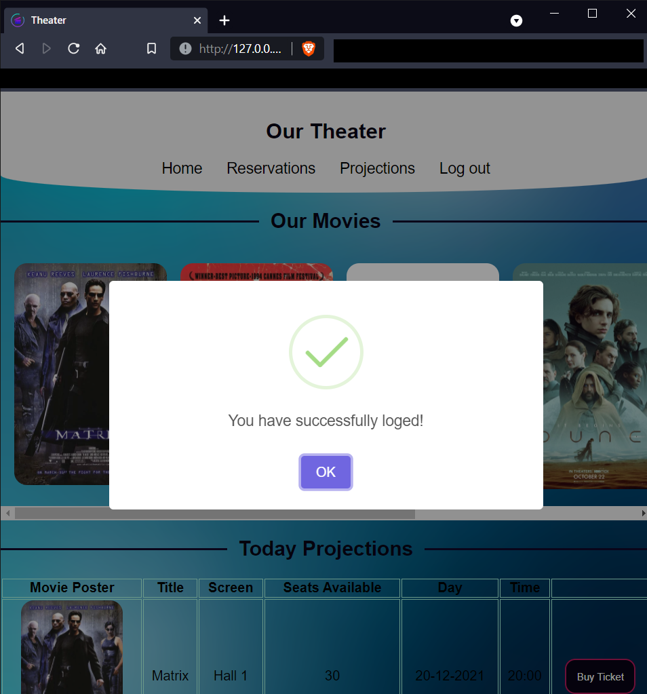
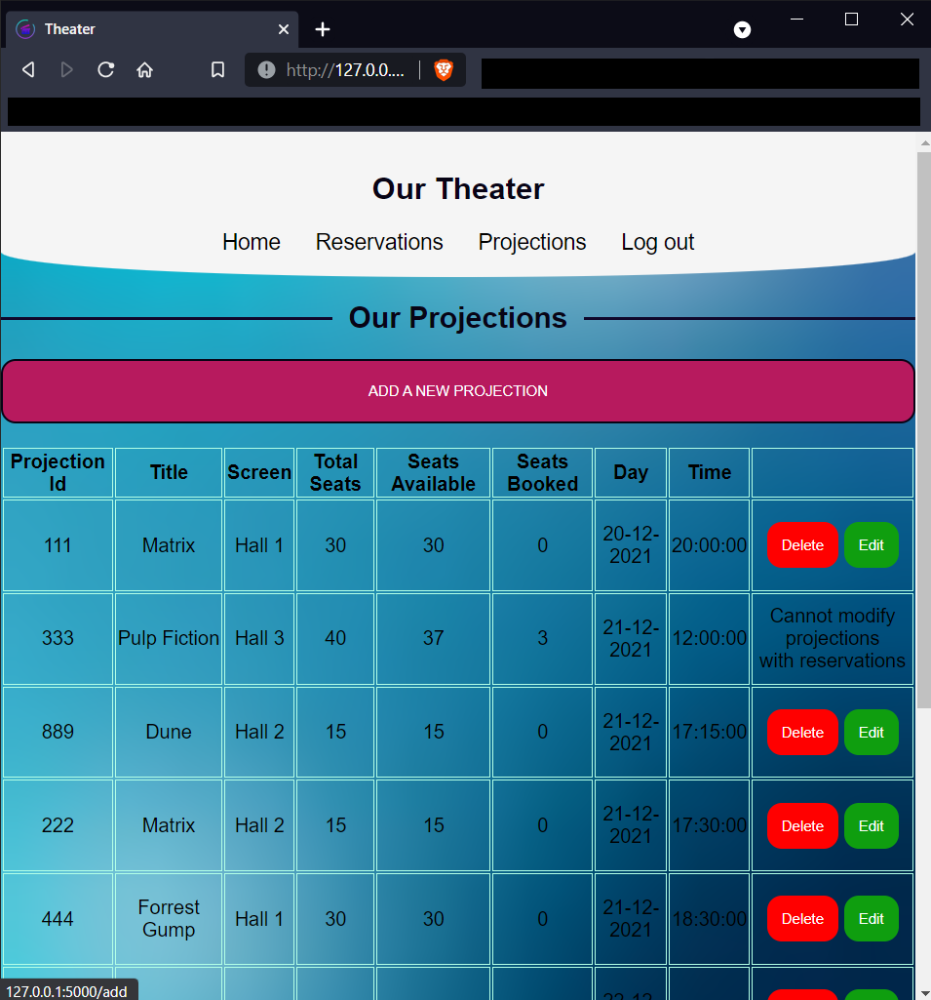
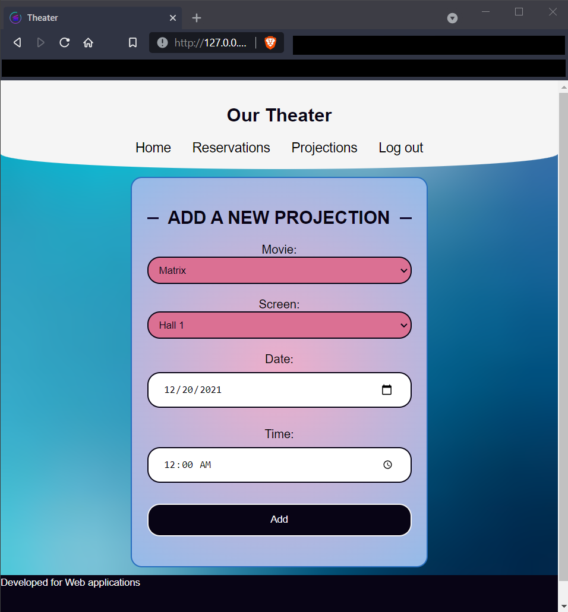

<h1 align="center">
   
  Theater Web App with Flask
</h1>
<h4 align="center">A theater management and ticket booking system</h5>
<h6 align="center">Written during my MAD-1 Course: <a href="https://www.uc3m.es/bachelor-degree/data-science">Bachelor of Science in Data Science & Applications</a> </h6>

 

  
Table of Contents

  <ul>
    <li><a href="#project-description">Project Description</a></li>
    <li><a href="#theater-app-screenshots">Theater App Screenshots</a></li>
    <li><a href="#technology">Technology</a></li>
  </ul>

## Project Description
This project is developed as part of the Evaluation of the Modern Applications Development Course at IITM BS Degree. 

<a href="ProjectStatement.html">Project Statement</a>: [Movie Theater](https://www.it.uc3m.es/jaf/wa/labs/project/).

## Theater App Screenshots

<table>
  <tr>
    <th>Sign Up</th>
    <th>Login</th>
  </tr>
  <tr>
    <td></td>
    <td></td>
  </tr>
 </table>

<table>
  <tr>
    <th>Success</th>
    <th>Error</th>
    <th>Info</th>
  </tr>
  <tr>
    <td></td>
    <td></td>
    <td></td>
  </tr>
 </table>

<table>
  <tr>
    <th>Home</th>
  </tr>
  <tr>
    <td></td>
  </tr>
 </table>

<table>
  <tr>
    <th>Movie View</th>
    <th>Buy Ticket</th>
  </tr>
  <tr>
    <td></td>
    <td></td>
  </tr>
 </table>

<table>
  <tr>
    <th>Manager Reservations View</th>
    <th>Manager Edit View</th>
  </tr>
  <tr>
    <td></td>
    <td></td>
  </tr>
</table>

<table>
  <tr>
    <th>Add Projection</th>
    <th>Edit Projection</th>
  </tr>
  <tr>
    <td></td>
    <td></td>
  </tr>
</table>

## Technology
- Backend:
  * Python
  * Flask Framework
  * SQLAlchemy
- Fronted:
  * HTML
  * CSS
  * JavaScipt + JQuery + AJAX
